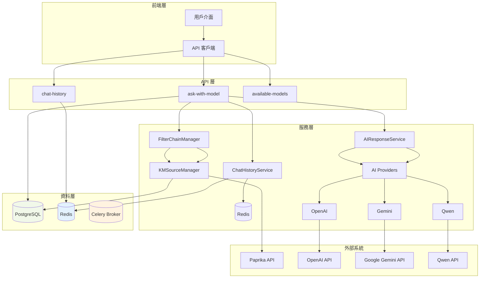
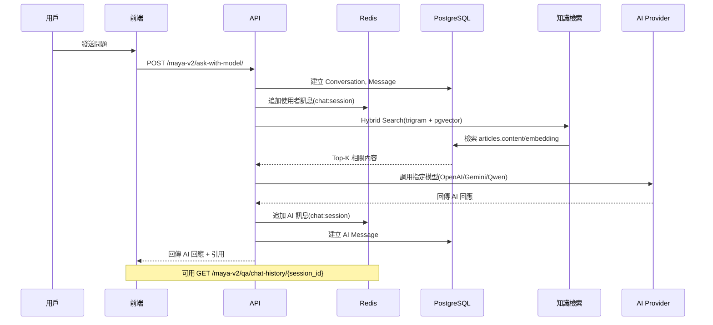

# Maya Sawa V2 - Gen AI 自動回覆平台

## 系統架構圖



<!-- 依現況精簡，移除未必要圖表 -->


## 對話流程圖



<!-- 移除 ER 與安全圖以符合現況精簡需求 -->

## 快速開始

```bash
# 複製環境變量模板
cp .env.example .env

# 編輯 .env 文件，填入你的配置

# 安裝依賴
poetry install

# 數據庫遷移
poetry run python manage.py migrate
poetry run python manage.py setup_ai_models

# 創建超級用戶
poetry run python manage.py createsuperuser

# 啟動服務
poetry run python manage.py runserver

# Celery Worker（新終端）
poetry run celery -A config worker -l info -Q maya_v2
```

## API 使用

### 獲取可用模型列表
```bash
curl -X GET "http://127.0.0.1:8000/maya-v2/available-models/"
```

### 使用指定模型進行對話
```bash
# 使用 GPT-4.1-nano 模型
curl -X POST "http://127.0.0.1:8000/maya-v2/ask-with-model/" \
  -H "Content-Type: application/json" \
  -d '{
    "question": "什麼是Java",
    "model_name": "gpt-4.1-nano",
    "sync": true,
    "use_knowledge_base": true
  }'

# 使用 GPT-4o-mini 模型
curl -X POST "http://127.0.0.1:8000/maya-v2/ask-with-model/" \
  -H "Content-Type: application/json" \
  -d '{
    "question": "如何實現多線程",
    "model_name": "gpt-4o-mini",
    "sync": true,
    "use_knowledge_base": true
  }'
```

### 添加新的 AI 模型
```bash
curl -X POST "http://127.0.0.1:8000/maya-v2/add-model/"
```

### 傳統對話 API（已棄用）
```bash
# 創建對話
curl -X POST "http://127.0.0.1:8000/maya-v2/conversations/" \
  -H "Content-Type: application/json" \
  -d '{"title": "新對話"}'

# 發送訊息
curl -X POST "http://127.0.0.1:8000/maya-v2/conversations/{conversation_id}/send_message/" \
  -H "Content-Type: application/json" \
  -d '{"content": "你好，請幫我解答問題"}'

# 獲取對話訊息
curl -X GET "http://127.0.0.1:8000/maya-v2/conversations/{conversation_id}/messages/"
```

## 授權

MIT License
