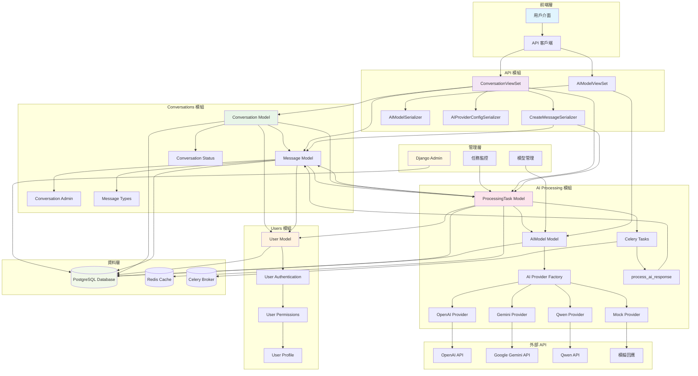
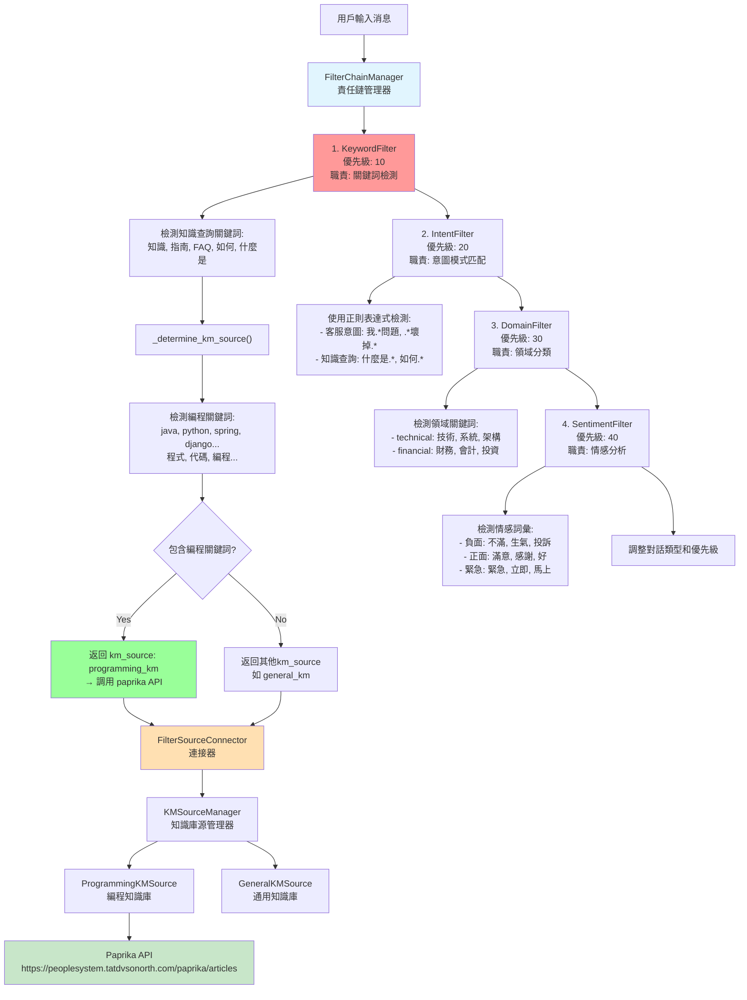
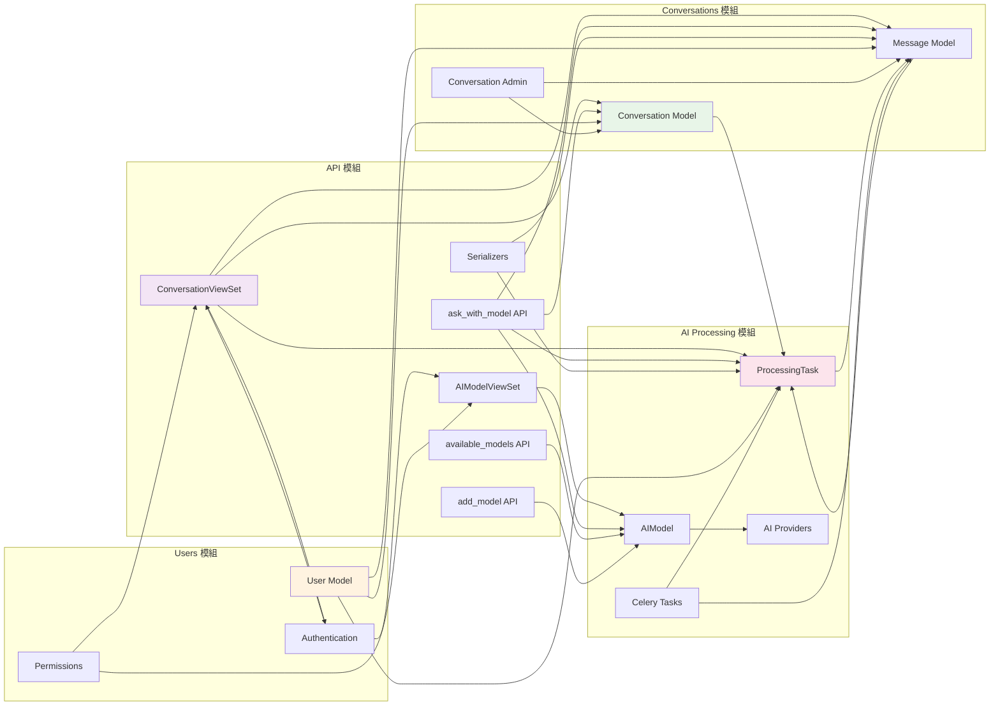
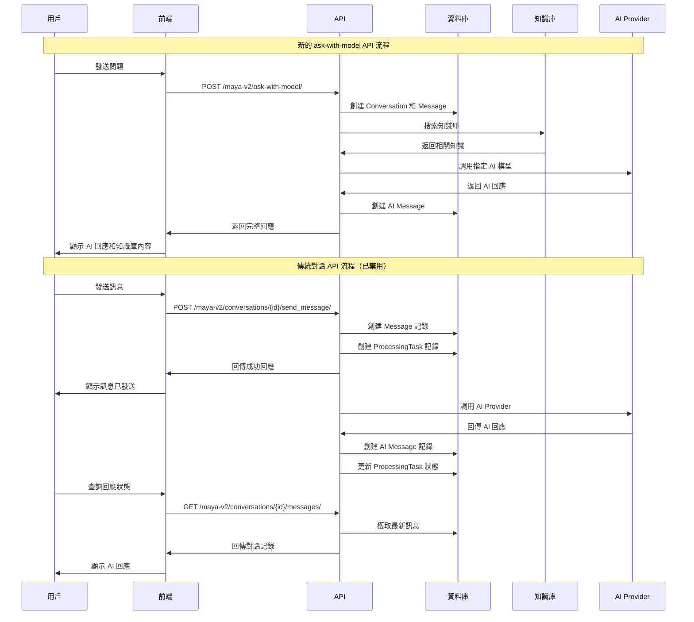
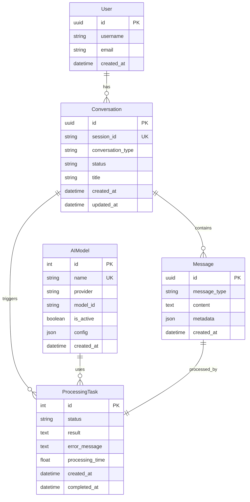
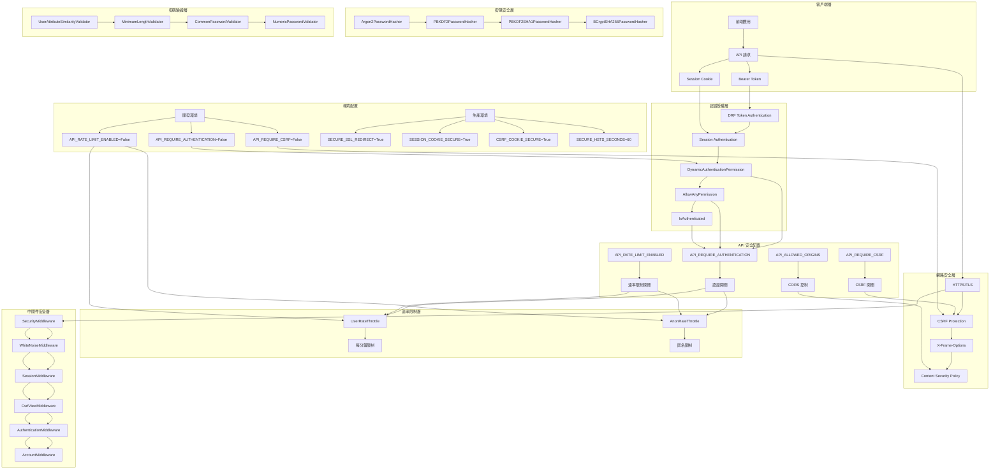

# Maya Sawa V2 - Gen AI 自動回覆平台

## 業務流程架構

### 系統架構圖



### Filter Chain 架構圖

Filter Chain 採用責任鏈設計模式，用於智能分析用戶輸入並路由到相應的知識庫源：



### 模組協作關係圖



### 對話流程圖



### 資料模型關係圖



### 安全性架構圖



## 開始

```bash
# 複製環境變量模板
cp .env.example .env

# 編輯 .env 文件，填入你的配置
# 詳細說明請參考 ENV_SETUP.md
```

### 2. 安裝依賴

```bash
poetry install
```

### 3. 數據庫遷移

```bash
poetry run python manage.py migrate
poetry run python manage.py setup_ai_models
```

### 4. 創建超級用戶

```bash
poetry run python manage.py createsuperuser
```

### 5. 啟動服務

```bash
# 開發環境
poetry run python manage.py runserver

# 生產環境
poetry run uvicorn config.asgi:application --host 0.0.0.0 --port 8000

# Celery Worker（新終端）
poetry run celery -A config worker -l info -Q maya_v2
```

## 快速測試

```bash
# 1. 啟動伺服器
poetry run python manage.py runserver

# 2. 獲取可用模型
curl -X GET "http://127.0.0.1:8000/maya-v2/available-models/"

# 3. 測試編程問題
curl -X POST "http://127.0.0.1:8000/maya-v2/ask-with-model/" \
  -H "Content-Type: application/json" \
  -d '{
    "question": "什麼是Java",
    "model_name": "gpt-4.1-nano",
    "sync": true,
    "use_knowledge_base": true
  }'

# 4. 測試一般問題
curl -X POST "http://127.0.0.1:8000/maya-v2/ask-with-model/" \
  -H "Content-Type: application/json" \
  -d '{
    "question": "如何學習編程",
    "model_name": "gpt-4.1-nano",
    "sync": true,
    "use_knowledge_base": true
  }'
```

## 開發命令

### 基本
```bash
# 檢查配置
poetry run python manage.py check

# 創建遷移
poetry run python manage.py makemigrations

# 執行遷移
poetry run python manage.py migrate

# 設置 AI 模型
poetry run python manage.py setup_ai_models
```

### 測試
```bash
# 運行測試
poetry run pytest

http://127.0.0.1:8000/api/redoc/

# 類型檢查
poetry run mypy maya_sawa_v2
```

### Celery 監控
```bash
# 查看 Worker 狀態
poetry run celery -A config inspect stats

# 查看活躍任務
poetry run celery -A config inspect active
```

### 新的 API 使用範例

#### 1. 獲取可用模型列表
```bash
curl -X GET "http://127.0.0.1:8000/maya-v2/available-models/"
```

#### 2. 使用指定模型進行對話（推薦）
```bash
# 使用 GPT-4.1-nano 模型
curl -X POST "http://127.0.0.1:8000/maya-v2/ask-with-model/" \
  -H "Content-Type: application/json" \
  -d '{
    "question": "什麼是Java",
    "model_name": "gpt-4.1-nano",
    "sync": true,
    "use_knowledge_base": true
  }'

# 使用 GPT-4o-mini 模型
curl -X POST "http://127.0.0.1:8000/maya-v2/ask-with-model/" \
  -H "Content-Type: application/json" \
  -d '{
    "question": "如何實現多線程",
    "model_name": "gpt-4o-mini",
    "sync": true,
    "use_knowledge_base": true
  }'
```

#### 3. 添加新的 AI 模型
```bash
curl -X POST "http://127.0.0.1:8000/maya-v2/add-model/"
```

#### 4. 傳統對話 API（已棄用）
```bash
# 創建對話
curl -X POST "http://127.0.0.1:8000/maya-v2/conversations/" \
  -H "Content-Type: application/json" \
  -d '{"title": "新對話"}'

# 發送訊息
curl -X POST "http://127.0.0.1:8000/maya-v2/conversations/{conversation_id}/send_message/" \
  -H "Content-Type: application/json" \
  -d '{"content": "你好，請幫我解答問題"}'

# 獲取對話訊息
curl -X GET "http://127.0.0.1:8000/maya-v2/conversations/{conversation_id}/messages/"
```

```json
{
  "session_id": "qa-abc12345",
  "conversation_id": "uuid-string",
  "question": "什麼是Java",
  "ai_model": {
    "id": 3,
    "name": "GPT-4.1 Nano",
    "provider": "openai"
  },
  "status": "completed",
  "ai_response": "Java是一種高級編程語言...",
  "knowledge_used": true,
  "message": "AI回复已完成"
}
```

#### 配置管理命令
```bash
# 從環境變數更新 AI 模型配置
poetry run python manage.py setup_ai_models
```

## 多語言翻譯

### 翻譯設置

首先在 `base.py` 中配置 `LANGUAGES` 設置，取消註釋你想要支援的語言。然後運行以下命令將翻譯字符串放置在此資料夾中：

```bash
python manage.py makemessages --all --no-location
```

這會在每個語言環境 `<locale name>/LC_MESSAGES/django.po` 下生成 `django.po`（Portable Object）文件。程式碼庫中的每個可翻譯字符串都會以其 `msgid` 收集，並需要翻譯為 `msgstr`，例如：

```po
msgid "users"
msgstr "utilisateurs"
```

完成所有翻譯後，需要將它們編譯成 `.mo` 文件（Machine Object），這些是應用程式實際使用的二進制文件：

```bash
python manage.py compilemessages
```

注意 `.po` 文件不會直接被應用程式使用，所以如果 `.mo` 文件過時，即使 `.po` 文件是最新的，內容也不會顯示為已翻譯。

### 生產環境

生產映像在構建時會自動運行 `compilemessages`，所以只要你的翻譯源文件（PO）是最新的，就可以了。

### 添加新語言

1. 更新專案基本設置中的 [`LANGUAGES` 設置](https://docs.djangoproject.com/en/stable/ref/settings/#std-setting-LANGUAGES)。
2. 在此文件旁邊為語言創建語言環境資料夾，例如法語的 `fr_FR`。確保大小寫正確。
3. 運行 `makemessages`（如上所述）為新語言生成 PO 文件。

## 授權

MIT License
