# Maya Sawa V2 - Gen AI 自動回覆平台

## 業務流程架構

### 系統架構圖

```mermaid
graph TB
    subgraph "前端層"
        A[用戶介面] --> B[API 客戶端]
    end
    
    subgraph "API 模組"
        B --> C[ConversationViewSet]
        B --> D[AIModelViewSet]
        C --> E[CreateMessageSerializer]
        D --> F[AIModelSerializer]
        C --> G[AIProviderConfigSerializer]
    end
    
    subgraph "Users 模組"
        H[User Model] --> I[User Authentication]
        I --> J[User Permissions]
        J --> K[User Profile]
    end
    
    subgraph "Conversations 模組"
        L[Conversation Model] --> M[Message Model]
        M --> N[Conversation Admin]
        L --> O[Conversation Status]
        M --> P[Message Types]
    end
    
    subgraph "AI Processing 模組"
        Q[ProcessingTask Model] --> R[AIModel Model]
        R --> S[AI Provider Factory]
        S --> T[OpenAI Provider]
        S --> U[Gemini Provider]
        S --> V[Qwen Provider]
        S --> W[Mock Provider]
        Q --> X[Celery Tasks]
        X --> Y[process_ai_response]
    end
    
    subgraph "外部 API"
        T --> Z[OpenAI API]
        U --> AA[Google Gemini API]
        V --> BB[Qwen API]
        W --> CC[模擬回應]
    end
    
    subgraph "資料層"
        DD[(PostgreSQL Database)]
        EE[(Redis Cache)]
        FF[(Celery Broker)]
    end
    
    subgraph "管理層"
        GG[Django Admin] --> DD
        HH[任務監控] --> Q
        II[模型管理] --> R
    end
    
    %% API 模組與其他模組的關係
    C --> L
    C --> M
    C --> Q
    D --> R
    E --> M
    E --> Q
    
    %% Users 模組與其他模組的關係
    L --> H
    M --> H
    Q --> H
    
    %% Conversations 模組與其他模組的關係
    M --> Q
    L --> Q
    
    %% AI Processing 模組與其他模組的關係
    Q --> M
    Y --> M
    X --> FF
    Q --> EE
    
    %% 資料層關係
    H --> DD
    L --> DD
    M --> DD
    Q --> DD
    R --> DD
    
    %% 樣式
    style A fill:#e1f5fe
    style C fill:#f3e5f5
    style H fill:#fff3e0
    style L fill:#e8f5e8
    style Q fill:#fce4ec
    style DD fill:#f1f8e9
    style GG fill:#fff8e1
```



### Filter Chain 架構圖

Filter Chain 採用責任鏈設計模式，用於智能分析用戶輸入並路由到相應的知識庫源：

```mermaid
graph TD
    A["用戶輸入消息"] --> B["FilterChainManager<br/>責任鏈管理器"]
    
    B --> C["1. KeywordFilter<br/>優先級: 10<br/>職責: 關鍵詞檢測"]
    C --> C1["檢測知識查詢關鍵詞:<br/>知識, 指南, FAQ, 如何, 什麼是"]
    C1 --> C2["_determine_km_source()"]
    C2 --> C3["檢測編程關鍵詞:<br/>java, python, spring, django...<br/>程式, 代碼, 編程..."]
    C3 --> C4{包含編程關鍵詞?}
    C4 -->|Yes| C5["返回 km_source: programming_km<br/>→ 調用 paprika API"]
    C4 -->|No| C6["返回其他km_source<br/>如 general_km"]
    
    C --> D["2. IntentFilter<br/>優先級: 20<br/>職責: 意圖模式匹配"]
    D --> D1["使用正則表達式檢測:<br/>- 客服意圖: 我.*問題, .*壞掉.*<br/>- 知識查詢: 什麼是.*, 如何.*"]
    
    D --> E["3. DomainFilter<br/>優先級: 30<br/>職責: 領域分類"]
    E --> E1["檢測領域關鍵詞:<br/>- technical: 技術, 系統, 架構<br/>- financial: 財務, 會計, 投資"]
    
    E --> F["4. SentimentFilter<br/>優先級: 40<br/>職責: 情感分析"]
    F --> F1["檢測情感詞彙:<br/>- 負面: 不滿, 生氣, 投訴<br/>- 正面: 滿意, 感謝, 好<br/>- 緊急: 緊急, 立即, 馬上"]
    F --> F2["調整對話類型和優先級"]
    
    C5 --> G["FilterSourceConnector<br/>連接器"]
    C6 --> G
    G --> H["KMSourceManager<br/>知識庫源管理器"]
    H --> I["ProgrammingKMSource<br/>編程知識庫"]
    H --> J["GeneralKMSource<br/>通用知識庫"]
    
    I --> K["Paprika API<br/>https://peoplesystem.tatdvsonorth.com/paprika/articles"]
    
    style C fill:#ff9999
    style C5 fill:#99ff99
    style B fill:#e1f5fe
    style G fill:#ffe0b2
    style K fill:#c8e6c9
```



### 模組協作關係圖


### 對話流程圖

```mermaid
sequenceDiagram
    participant U as 用戶
    participant F as 前端
    participant A as API
    participant DB as 資料庫
    participant KM as 知識庫
    participant AI as AI Provider
    
    Note over U,AI: 新的 ask-with-model API 流程
    
    U->>F: 發送問題
    F->>A: POST /maya-v2/ask-with-model/
    A->>DB: 創建 Conversation 和 Message
    A->>KM: 搜索知識庫
    KM->>A: 返回相關知識
    A->>AI: 調用指定 AI 模型
    AI->>A: 返回 AI 回應
    A->>DB: 創建 AI Message
    A->>F: 返回完整回應
    F->>U: 顯示 AI 回應和知識庫內容
    
    Note over U,AI: 傳統對話 API 流程（已棄用）
    
    U->>F: 發送訊息
    F->>A: POST /maya-v2/conversations/{id}/send_message/
    A->>DB: 創建 Message 記錄
    A->>DB: 創建 ProcessingTask 記錄
    A->>F: 回傳成功回應
    F->>U: 顯示訊息已發送
    
    A->>AI: 調用 AI Provider
    AI->>A: 回傳 AI 回應
    A->>DB: 創建 AI Message 記錄
    A->>DB: 更新 ProcessingTask 狀態
    
    U->>F: 查詢回應狀態
    F->>A: GET /maya-v2/conversations/{id}/messages/
    A->>DB: 獲取最新訊息
    A->>F: 回傳對話記錄
    F->>U: 顯示 AI 回應
```



### 資料模型關係圖


## 開始

```bash
# 複製環境變量模板
cp .env.example .env

# 編輯 .env 文件，填入你的配置
# 詳細說明請參考 ENV_SETUP.md
```

### 2. 安裝依賴

```bash
poetry install
```

### 3. 數據庫遷移

```bash
poetry run python manage.py migrate
poetry run python manage.py setup_ai_models
```

### 4. 創建超級用戶

```bash
poetry run python manage.py createsuperuser
```

### 5. 啟動服務

```bash
# 開發環境
poetry run python manage.py runserver

# 生產環境
poetry run uvicorn config.asgi:application --host 0.0.0.0 --port 8000

# Celery Worker（新終端）
poetry run celery -A config worker -l info -Q maya_v2
```

## 快速測試

```bash
# 1. 啟動伺服器
poetry run python manage.py runserver

# 2. 獲取可用模型
curl -X GET "http://127.0.0.1:8000/maya-v2/available-models/"

# 3. 測試編程問題
curl -X POST "http://127.0.0.1:8000/maya-v2/ask-with-model/" \
  -H "Content-Type: application/json" \
  -d '{
    "question": "什麼是Java",
    "model_name": "gpt-4.1-nano",
    "sync": true,
    "use_knowledge_base": true
  }'

# 4. 測試一般問題
curl -X POST "http://127.0.0.1:8000/maya-v2/ask-with-model/" \
  -H "Content-Type: application/json" \
  -d '{
    "question": "如何學習編程",
    "model_name": "gpt-4o-mini",
    "sync": true,
    "use_knowledge_base": true
  }'
```

## 開發命令

### 基本
```bash
# 檢查配置
poetry run python manage.py check

# 創建遷移
poetry run python manage.py makemigrations

# 執行遷移
poetry run python manage.py migrate

# 設置 AI 模型
poetry run python manage.py setup_ai_models
```

### 測試
```bash
# 運行測試
poetry run pytest

http://127.0.0.1:8000/api/redoc/

# 類型檢查
poetry run mypy maya_sawa_v2
```

### Celery 監控
```bash
# 查看 Worker 狀態
poetry run celery -A config inspect stats

# 查看活躍任務
poetry run celery -A config inspect active
```

### 新的 API 使用範例

#### 1. 獲取可用模型列表
```bash
curl -X GET "http://127.0.0.1:8000/maya-v2/available-models/"
```

#### 2. 使用指定模型進行對話（推薦）
```bash
# 使用 GPT-4.1-nano 模型
curl -X POST "http://127.0.0.1:8000/maya-v2/ask-with-model/" \
  -H "Content-Type: application/json" \
  -d '{
    "question": "什麼是Java",
    "model_name": "gpt-4.1-nano",
    "sync": true,
    "use_knowledge_base": true
  }'

# 使用 GPT-4o-mini 模型
curl -X POST "http://127.0.0.1:8000/maya-v2/ask-with-model/" \
  -H "Content-Type: application/json" \
  -d '{
    "question": "如何實現多線程",
    "model_name": "gpt-4o-mini",
    "sync": true,
    "use_knowledge_base": true
  }'
```

#### 3. 添加新的 AI 模型
```bash
curl -X POST "http://127.0.0.1:8000/maya-v2/add-model/"
```

#### 4. 傳統對話 API（已棄用）
```bash
# 創建對話
curl -X POST "http://127.0.0.1:8000/maya-v2/conversations/" \
  -H "Content-Type: application/json" \
  -d '{"title": "新對話"}'

# 發送訊息
curl -X POST "http://127.0.0.1:8000/maya-v2/conversations/{conversation_id}/send_message/" \
  -H "Content-Type: application/json" \
  -d '{"content": "你好，請幫我解答問題"}'

# 獲取對話訊息
curl -X GET "http://127.0.0.1:8000/maya-v2/conversations/{conversation_id}/messages/"
```

```json
{
  "session_id": "qa-abc12345",
  "conversation_id": "uuid-string",
  "question": "什麼是Java",
  "ai_model": {
    "id": 3,
    "name": "GPT-4.1 Nano",
    "provider": "openai"
  },
  "status": "completed",
  "ai_response": "Java是一種高級編程語言...",
  "knowledge_used": true,
  "message": "AI回复已完成"
}
```

#### 配置管理命令
```bash
# 從環境變數更新 AI 模型配置
poetry run python manage.py setup_ai_models
```

## API 測試

### 📁 測試文件說明

#### 1. `test_conversation_api_simple.py`
- **功能**: 使用 Python 內建模組測試 API
- **依賴**: 僅使用 Python 內建模組（urllib, json）
- **測試內容**:
  - 直接問答 API
  - AI 提供者配置
  - 對話列表
  - 顯示對應的 curl 命令

#### 2. `test_traditional_conversation_api.py`
- **功能**: 完整的傳統對話流程測試
- **依賴**: 需要安裝 `requests` 模組
- **測試內容**:
  - 創建對話
  - 發送訊息
  - 等待 AI 處理
  - 查看訊息歷史

#### 3. `test_openai_fix.py`
- **功能**: 測試 OpenAI 客戶端修復
- **依賴**: Django 環境
- **測試內容**:
  - OpenAI 提供者配置
  - Mock 提供者測試
  - API 端點驗證

#### 4. `run_api_tests.sh`
- **功能**: Shell 腳本自動化測試
- **依賴**: 需要 `curl` 和 `python3`
- **測試內容**: 所有主要 API 端點的快速測試

### 🚀 使用方法

#### 方法 1: 使用 Shell 腳本（推薦）
```bash
# 確保服務正在運行
poetry run python manage.py runserver

# 在另一個終端運行測試
./tests/run_api_tests.sh
```

#### 方法 2: 使用 Python 測試腳本
```bash
# 運行簡單測試（無外部依賴）
python3 tests/test_conversation_api_simple.py

# 運行完整測試（需要 requests）
pip install requests
python3 tests/test_traditional_conversation_api.py

# 運行 OpenAI 修復測試
python3 tests/test_openai_fix.py
```

#### 方法 3: 手動測試
```bash
# 1. 直接問答 API
curl "http://127.0.0.1:8000/maya-v2/conversations/ask/?question=你好，請介紹一下這個系統&sync=true"

# 2. 獲取 AI 提供者
curl "http://127.0.0.1:8000/maya-v2/conversations/ai_providers/"

# 3. 獲取對話列表
curl "http://127.0.0.1:8000/maya-v2/conversations/"

# 4. 創建新對話
curl -X POST "http://127.0.0.1:8000/maya-v2/conversations/" \
  -H "Content-Type: application/json" \
  -d '{"title": "測試對話", "conversation_type": "general", "session_id": "test-123"}'
```

### 📋 API 端點說明

#### 直接問答 API（推薦）
- **端點**: `GET /maya-v2/conversations/ask/`
- **參數**: 
  - `question`: 問題內容
  - `sync`: 是否同步處理（true/false）
  - `model`: 指定 AI 模型
- **用途**: 最簡單的 AI 對話方式

#### 傳統對話流程
1. **創建對話**: `POST /maya-v2/conversations/`
2. **發送訊息**: `POST /maya-v2/conversations/{id}/send_message/`
3. **查看訊息**: `GET /maya-v2/conversations/{id}/messages/`

#### AI 模型相關
- **獲取提供者**: `GET /maya-v2/conversations/ai_providers/`
- **獲取模型列表**: `GET /maya-v2/ai-models/`

### 🔧 故障排除

#### OpenAI 客戶端錯誤修復
**問題**: `Client.__init__() got an unexpected keyword argument 'proxies'`

**解決方案**: 
1. 已修復 `maya_sawa_v2/ai_processing/ai_providers.py`
2. 移除了不支援的參數傳遞
3. 改進了錯誤處理

**測試修復**:
```bash
python3 tests/test_openai_fix.py
```

#### 連接錯誤
```bash
# 確保服務正在運行
poetry run python manage.py runserver
```

#### URL 編碼問題
```bash
# 使用 curl 的 -G 參數
curl -G "http://127.0.0.1:8000/maya-v2/conversations/ask/" \
  --data-urlencode "question=你好，請介紹一下這個系統" \
  --data-urlencode "sync=true"
```

#### 權限問題
```bash
# 給腳本執行權限
chmod +x tests/run_api_tests.sh
```

### 📊 測試結果解讀

#### 成功回應範例
```json
{
  "session_id": "qa-abc12345",
  "conversation_id": "uuid-here",
  "question": "你的問題",
  "ai_model": {
    "id": 1,
    "name": "GPT-4o Mini",
    "provider": "openai"
  },
  "status": "completed",
  "ai_response": "AI 的回應內容"
}
```

#### 錯誤回應範例
```json
{
  "error": "錯誤訊息"
}
```

### 🎯 測試重點

1. **服務連接**: 確保 Django 服務正在運行
2. **API 端點**: 測試所有主要端點是否正常
3. **參數處理**: 測試 URL 編碼和 JSON 數據
4. **回應格式**: 確認回應格式正確
5. **錯誤處理**: 測試錯誤情況的處理
6. **OpenAI 修復**: 驗證客戶端配置修復

### 📝 注意事項

- 測試前請確保服務正在運行
- 開發環境已禁用認證，可直接測試
- 如果使用異步處理，需要等待 AI 回應
- 建議先測試直接問答 API，再測試完整流程
- OpenAI 客戶端錯誤已修復，如果仍有問題請檢查 API Key 配置

### 🔄 最近修復

#### OpenAI 客戶端配置問題
- **問題**: `Client.__init__() got an unexpected keyword argument 'proxies'`
- **原因**: 傳遞了不支援的參數給 OpenAI 客戶端
- **修復**: 
  - 只傳遞支援的參數（api_key, base_url, organization）
  - 改進了錯誤處理
  - 添加了更好的參數驗證
- **測試**: 使用 `test_openai_fix.py` 驗證修復

## 多語言翻譯

### 翻譯設置

首先在 `base.py` 中配置 `LANGUAGES` 設置，取消註釋你想要支援的語言。然後運行以下命令將翻譯字符串放置在此資料夾中：

```bash
python manage.py makemessages --all --no-location
```

這會在每個語言環境 `<locale name>/LC_MESSAGES/django.po` 下生成 `django.po`（Portable Object）文件。程式碼庫中的每個可翻譯字符串都會以其 `msgid` 收集，並需要翻譯為 `msgstr`，例如：

```po
msgid "users"
msgstr "utilisateurs"
```

完成所有翻譯後，需要將它們編譯成 `.mo` 文件（Machine Object），這些是應用程式實際使用的二進制文件：

```bash
python manage.py compilemessages
```

注意 `.po` 文件不會直接被應用程式使用，所以如果 `.mo` 文件過時，即使 `.po` 文件是最新的，內容也不會顯示為已翻譯。

### 生產環境

生產映像在構建時會自動運行 `compilemessages`，所以只要你的翻譯源文件（PO）是最新的，就可以了。

### 添加新語言

1. 更新專案基本設置中的 [`LANGUAGES` 設置](https://docs.djangoproject.com/en/stable/ref/settings/#std-setting-LANGUAGES)。
2. 在此文件旁邊為語言創建語言環境資料夾，例如法語的 `fr_FR`。確保大小寫正確。
3. 運行 `makemessages`（如上所述）為新語言生成 PO 文件。

## 授權

MIT License
