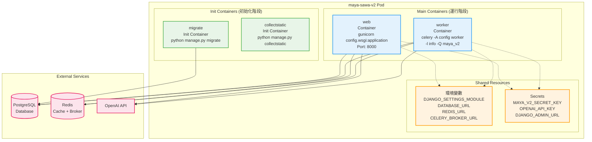
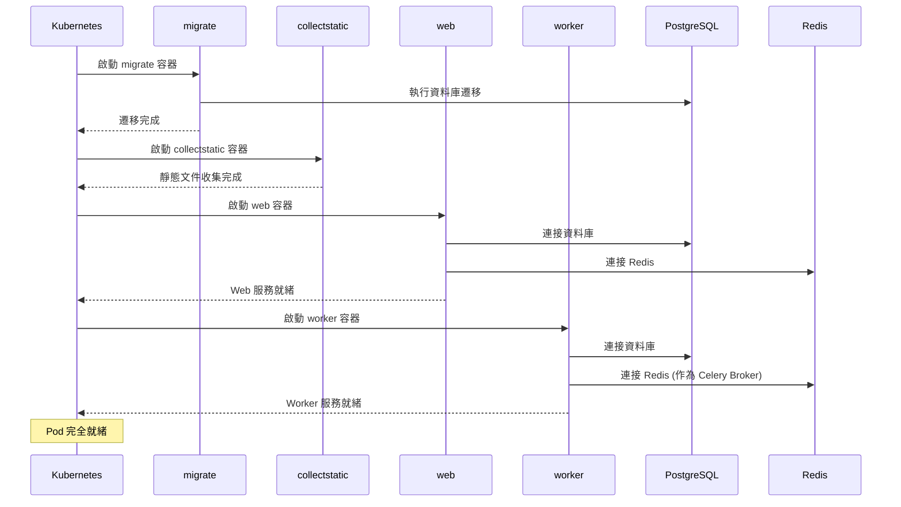
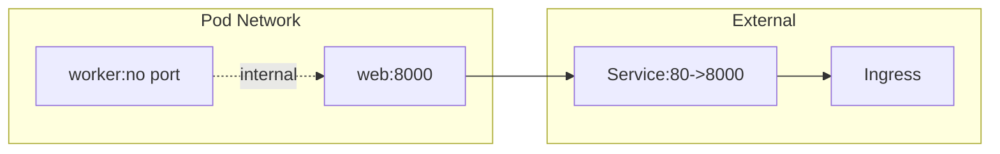
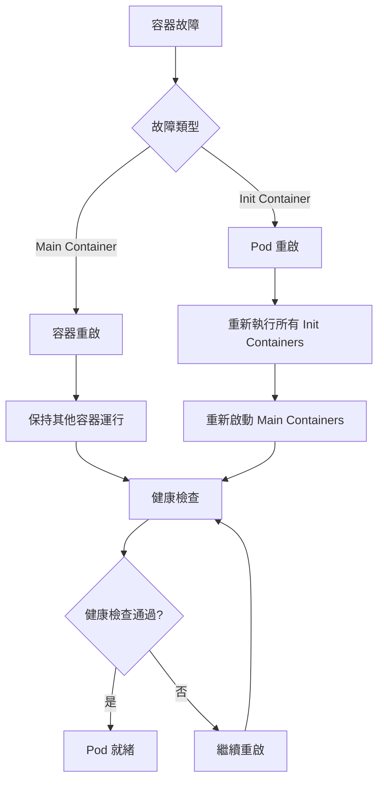
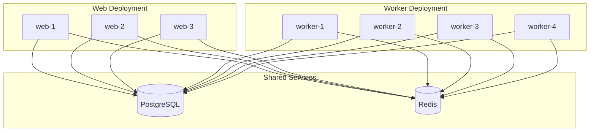

# Maya Sawa V2 - Pod 內多容器架構

## 整體 Pod 架構圖



## 容器詳細配置

### Init Containers (初始化容器)

#### 1. migrate 容器
```yaml
- name: migrate
  image: papakao/maya-sawa-v2:latest
  command: ["bash", "-lc", "python manage.py migrate --noinput"]
  env:
    - name: DJANGO_SETTINGS_MODULE
      value: config.settings.production
    - name: DATABASE_URL
      valueFrom:
        secretKeyRef:
          name: app-config
          key: DATABASE_URL
    - name: MAYA_V2_SECRET_KEY
      valueFrom:
        secretKeyRef:
          name: django-secrets
          key: MAYA_V2_SECRET_KEY
```

#### 2. collectstatic 容器
```yaml
- name: collectstatic
  image: papakao/maya-sawa-v2:latest
  command: ["bash", "-lc", "python manage.py collectstatic --noinput"]
  env:
    - name: DJANGO_SETTINGS_MODULE
      value: config.settings.production
    - name: MAYA_V2_SECRET_KEY
      valueFrom:
        secretKeyRef:
          name: django-secrets
          key: MAYA_V2_SECRET_KEY
```

### Main Containers (主要容器)

#### 1. web 容器 (Django + Gunicorn)
```yaml
- name: web
  image: papakao/maya-sawa-v2:latest
  ports:
    - containerPort: 8000
  resources:
    requests:
      cpu: 25m
      memory: 128Mi
    limits:
      cpu: 100m
      memory: 256Mi
  env:
    - name: DJANGO_SETTINGS_MODULE
      value: config.settings.production
    - name: DATABASE_URL
      valueFrom:
        secretKeyRef:
          name: app-config
          key: DATABASE_URL
    - name: REDIS_URL
      valueFrom:
        secretKeyRef:
          name: app-config
          key: REDIS_URL
    - name: CELERY_BROKER_URL
      valueFrom:
        secretKeyRef:
          name: app-config
          key: CELERY_BROKER_URL
    - name: OPENAI_API_KEY
      valueFrom:
        secretKeyRef:
          name: django-secrets
          key: OPENAI_API_KEY
  readinessProbe:
    httpGet:
      path: /healthz
      port: 8000
    initialDelaySeconds: 20
    periodSeconds: 10
  livenessProbe:
    httpGet:
      path: /healthz
      port: 8000
    initialDelaySeconds: 45
    periodSeconds: 30
```

#### 2. worker 容器 (Celery)
```yaml
- name: worker
  image: papakao/maya-sawa-v2:latest
  command: ["bash", "-lc", "celery -A config worker -l info -Q maya_v2"]
  resources:
    requests:
      cpu: 25m
      memory: 128Mi
    limits:
      cpu: 100m
      memory: 256Mi
  env:
    - name: DJANGO_SETTINGS_MODULE
      value: config.settings.production
    - name: DATABASE_URL
      valueFrom:
        secretKeyRef:
          name: app-config
          key: DATABASE_URL
    - name: REDIS_URL
      valueFrom:
        secretKeyRef:
          name: app-config
          key: REDIS_URL
    - name: CELERY_BROKER_URL
      valueFrom:
        secretKeyRef:
          name: app-config
          key: CELERY_BROKER_URL
    - name: OPENAI_API_KEY
      valueFrom:
        secretKeyRef:
          name: django-secrets
          key: OPENAI_API_KEY
```

## 容器啟動順序



## 資源分配

### CPU 和記憶體分配


### 網絡配置


## 故障處理機制

### 容器重啟策略


### 健康檢查
- **web 容器**: HTTP GET `/healthz`
- **worker 容器**: 無健康檢查 (Celery 內部管理)
- **init 容器**: 命令執行成功即為健康

## 優缺點分析

### 優點 ✅
1. **簡單部署**: 一個 Pod 包含所有組件
2. **共享配置**: 環境變數和 secrets 統一管理
3. **資源共享**: 可以共享 volume 和網絡
4. **故障隔離**: 如果一個容器失敗，其他容器仍可運行
5. **原子性**: 所有組件一起啟動和停止

### 缺點 ⚠️
1. **資源競爭**: Web 和 Worker 競爭 CPU/記憶體
2. **擴展限制**: 無法獨立擴展 Web 或 Worker
3. **單點故障**: Pod 重啟會影響所有服務
4. **資源浪費**: 無法針對不同服務優化資源分配
5. **調試困難**: 多個容器日誌混合在一起

## 建議的改進架構

### 分離部署 (推薦)


這樣可以：
- **獨立擴展** Web 和 Worker
- **資源優化** 針對不同服務分配資源
- **故障隔離** 更好的容錯能力
- **監控分離** 更清晰的日誌和監控
